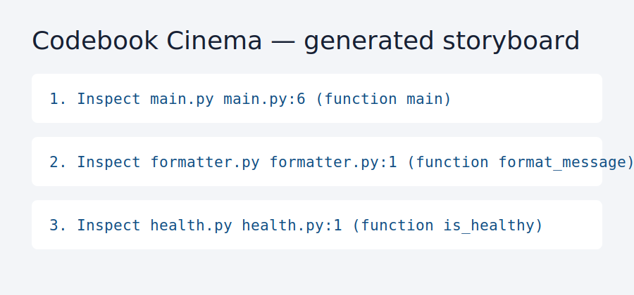

# Codebook Cinema

[](https://github.com/KanadeK/codebook-cinema/actions/workflows/ci.yml) [](LICENSE) [](https://github.com/KanadeK/codebook-cinema/releases)

**Turn a Python or TypeScript repository into evidence-linked teaching chapters, a Mermaid architecture diagram, an editable shot list, and narration drafts — locally, without an online LLM.**



- Every statement links to an actual file and, where present, a parsed top-level symbol.
- Produces JSON, Markdown, and a standalone HTML storyboard you can edit or present.
- Keeps uncertainty honest: structural descriptions that cannot be verified are labelled `unknown`.

```bash
python -m pip install -e '.[dev]'
codebook-cinema analyze examples/python_cli --output demo-output
```

Open `demo-output/storyboard.html`. The command scans real source files and emits, for example, `main.py:8 (function main)` beside a matching narration line.

**Status:** v0.1.0. A public-repository sample search found no active same-name, highly isomorphic project; see [the comparison](docs/COMPETITOR_SCAN.md).

## Features

- Local Python (`ast`) and TypeScript (`tree-sitter` syntax validation plus source declarations) scanning.
- Verified files, imports, top-level functions/classes/interfaces/types, and entry-point detection.
- Deterministic chapters, Mermaid flowchart, five-or-more-shot storyboard when source provides five modules, and narration drafts.
- Secret-looking assignment values redacted from generated text.

## Non-goals

Codebook Cinema is not a language model, an IDE, a deep semantic verifier, or a replacement for a security review. It does not claim what a function *means* beyond parsed source facts.

## Architecture

The pure domain assembles reports; filesystem/parser adapters obtain facts; services orchestrate analysis and Jinja2 exports; Typer delivers the CLI. More detail: [architecture](docs/ARCHITECTURE.md).

## Installation and quick start

Python 3.12 is required.

```bash
python -m pip install -e '.[dev]'
codebook-cinema analyze examples/typescript_api -o demo-output
```

The output directory contains `report.json`, `report.md`, and `storyboard.html`. No network request occurs during analysis.

## CLI

```text
codebook-cinema analyze REPOSITORY --output DIRECTORY
```

The command exits non-zero for missing directories, unsupported-only repositories, unreadable files, and malformed Python. Removing an entry file changes the report and emits an explicit no-entry warning.

## Examples

`examples/python_cli` and `examples/typescript_api` are small MIT-licensed fixtures committed to this repository. Both contain an entry point and five source modules, so each produces a graph and at least five shots. Generate both with `make demo`.

## Testing

```bash
make verify
make demo
make package
make release-check
```

`make verify` runs Ruff, strict mypy, pytest (including unit, integration, E2E, failures, and redaction) with an 80% source coverage threshold, then builds package artifacts.

## Privacy and security

All source processing is local. Generated reports contain paths, imports, and symbol names as evidence, but redact values that resemble API keys, tokens, passwords, or secrets. See [privacy and security](docs/PRIVACY_AND_SECURITY.md).

## Roadmap

- More language adapters with the same evidence contract.
- Optional user-supplied narration templates.
- Source-line links for Git hosting providers, kept opt-in.

## Contributing

Read [CONTRIBUTING.md](CONTRIBUTING.md), use the issue forms, and include real fixtures for parser fixes.

## FAQ

**Does it invent business behavior?** No. If structure does not prove a purpose, the output says `unknown`.

**Does it upload my repository?** No. v0.1.0 performs no HTTP call.
